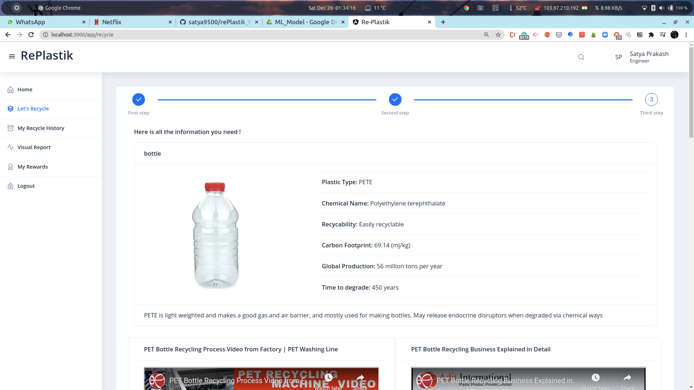
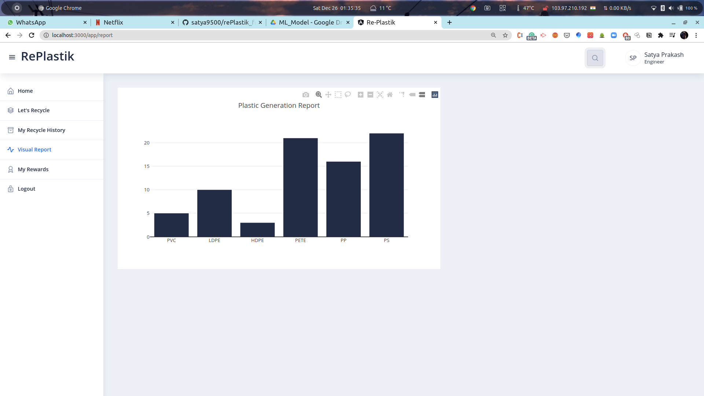

# RePlastik
This project classifies types of plastics ad gives insights about the same to the users.
Also suggests recycling/reusing process after analyzing the plastic.
Generates Visual reports using plotly.

[Frontend of this project](https://github.com/satya9500/rePlastik_frontend)

[ML Models for this project](https://github.com/satya9500/rePlastik_ML)

## Tech Stack
1. Frontend - Angular 
2. UI Component Library - [Nebular](https://akveo.github.io/nebular/docs/getting-started/what-is-nebular#what-is-nebular)
3. Graphs - PlotlyJS
4. Backend - NodeJS
5. DB - MongoDB
6. ML Models and APIs - Flask and fastai

## Screenshots

### Registration Page
 

### Login Page
 

### Home Page
 

### Classification Steps

**First**
 

**Second**

**Third**
 
 

### Classification History

### Visual Report

### Search Page

#### How to run nodejs server
**You need to create a .env file containing following information**

PORT=3000\
MONGO_URI=<mongodb_uri>\
JWT_SECRET=<secret_ket>\
JWT_EXPIRES_IN=<JWT_Token_Expiration_time>\
JWT_COOKIE_EXPIRE=<JWT_Cookie_Expiration time>\
YT_API_KEY=<Youtube_API_Key>\
IMGBB_KEY=<IMGBB_API_KEY>\
NEWS_API_KEY=<newsapi.org api key>

**Steps**
1. `git clone https://github.com/satya9500/rePlastik_backend.git`
2. `cd rePlastik_backend`
3. `npm i`
4. `npm start`
5. `Server will run on your defined port in .env`

